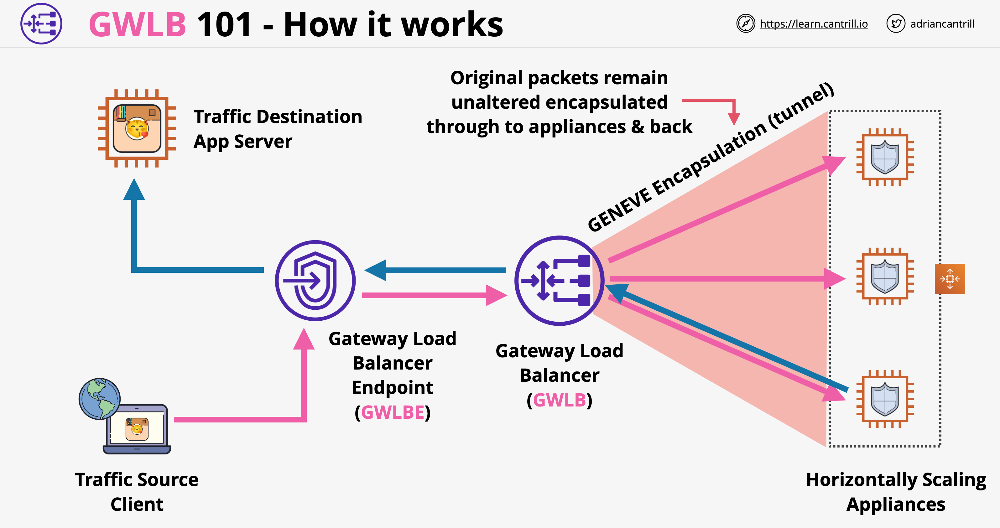

# GWLB - Gateway Load Balancers

- Is a product to help us run and scale third party security appliances, like: third-party firewalls, intrusion detections systems and prevention systems
- We might use these to perform inbound/outbound transparent traffic inspection and protection
- At a high level a GWLB has 2 major components:
    - GWLB endpoints: run from a VPC from which the traffic we want to monitor originates or where the traffic is destined to
        - They are similar to interface endpoints
    - GWLB itself, balancing packets across multiple backend appliances
- GWLB use a protocol called `GENEVE`, a tunneling protocol. A tunnel is created between the GWLB and backend security appliances, meaning that packets are unaltered, they have the same source/destination IP addresses and same contents when they sent

- GWLB balances across security appliances, meaning we can use multiple security appliances if one fails
- GWLB architecture:

