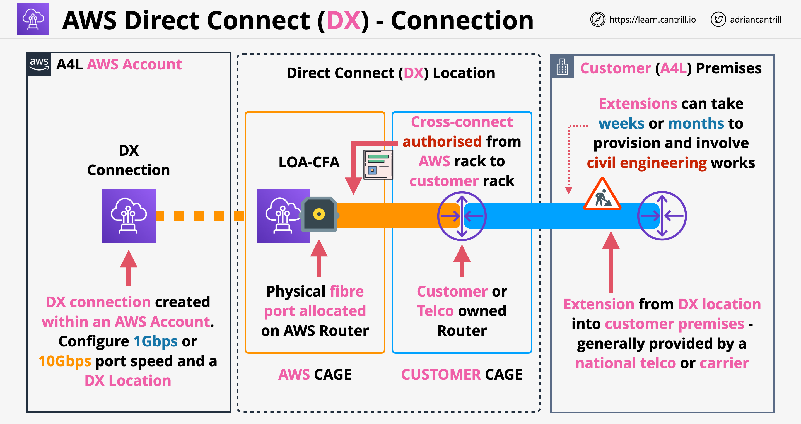
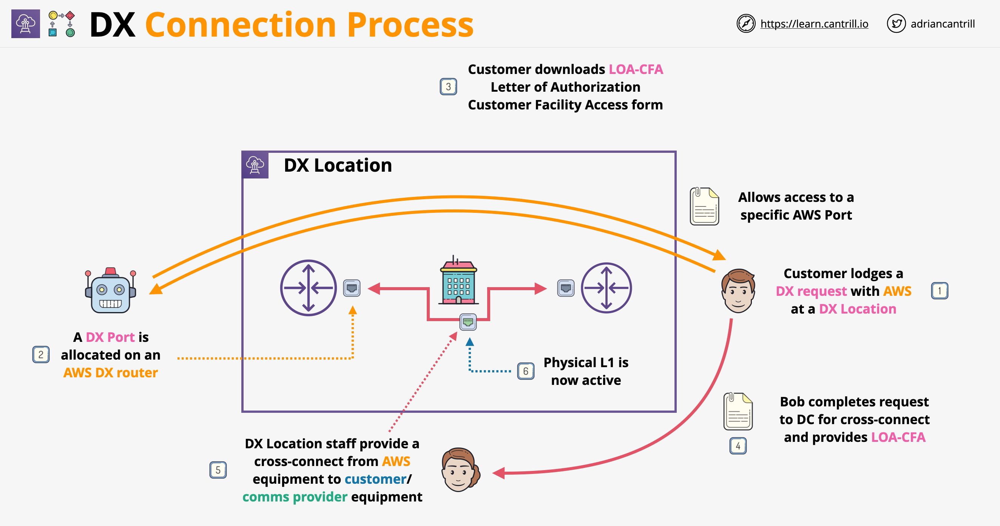

# Direct Connect

## Concepts

- It is a physical connection into an AWS region
- It can be 1, 10 or 100 Gbps connection
- The connection is between the *business premisses* => *DX Location* => *AWS Region*
- When we order a DX connection, actually we order a port allocation at a DX location. It does not provide a connection of any kind by itself, it is just a physical port. It is up to us to connect to this directly or arrange a connection to be extended via a third party comms provider
- The cost for DX includes a hourly cost + cost for the outbound data transfer. Inbound data transfer is free of charge
- To be taken in consideration:
    - Provisioning time: AWS will take time to allocate a port + arrange connection to the premises (weeks/months)
    - No builtin resilience by default
    - Provides low and consistent latency + high speeds
    - DX can be used to access AWS Private Services (running in VPCs) and AWS Public Services
- DX architecture:

    

## Physical Connection Architecture

- A direct connect is a physical port allocated at DX location, this physical port provides either 1, 10 or 100 Gbps connection speed
- Port allocated at the DX location requires the use of single-mode fibre, we can't connect using copper connection
- Physical layer connection standards:
    - 1Gbps connection: **1000BASE-LX** (1310nm) Transceiver
    - 10Gbps connection: **10GBASE-LR** (1310nm) Transceiver
    - 100Gbps connection: **100GBASE-LR4** Transceiver
- In terms of the configuration for the DX ports:
    - We have to make sure that Auto-Negotiation is disabled
    - We configure the port speed
    - Full-duplex has to be manually set on the network connection
- The router on the DX location should support the *BGP* protocol and *BGP MD5* based Authentication
- Optional configurations:
    - MACsec
    - Bidirectional Forwarding Detection (BFD)

## Direct Connect - MACsec

- It is a security feature that improves/partially improves a long-standing problem with DX: lack of builtin encryption
- It is a standard which allows frames on the network to be encrypted. Frames are the unit of data which occur at the layer 2 of the OSI model
- MACsec provides a hop by hop encryption architecture => 2 devices need to be next to each other at layer 2 to order MACsec (layer 2 adjacency)
- MACsec features:
    - *Confidentiality*: strong encryption at layer 2 by encryption the frame's EtherType and payload
    - *Data integrity*: adds additional fields to ensure that data cannot be modified in transit without both parties being able to detect the modification
    - *Data origin authenticity*: both parties can see that frames were been sent by other trusted peer
    - *Replay protection*
- MACsec does not replaces IPSEC over DX, it is not end-2-end!
- It is designed to allow transfer for super high speeds for terabit networks
- MACsec key components:
    - **Secure Channel** (unidirectional): each MACsec participant creates a MACsec channel that is used to send traffic
    - **Secure Channels are assigned an identifier (SCI)**: uniquely identifies a secure channel
    - **Secure Associations**: communication that occurs on each secure channel, takes place as a series of transient sessions, multiple secure associations will take place on each secure channel over the lifetime of the connection. Each secure channel generally has 1 secure association at a time (exception when the associations are being replaced)
    - **MACsec encapsulation**: 16 bytes **MACsec tag** & 16 bytes of Integrity Check Value (**ICV**). MACSec modifies Ethernet frames by inserting these tags
    - **MACSec Key Agreement protocol**: manages discovery, authentication and key generation
    - **Cipher Suite**: controls how the data is encrypted: algorithm, packets per key, key rotation

    

    

- MACsec architecture:

    

    

- MACsec can be defined either ona DX connection on a Link Aggregation Group (LAG)
- Configuring MACsec: we associate a CAK/CKN pair with the connection on both the AWS DX router(s) and customer side's router
- It is possible to extend MACsec from the DX location ot the customer side
- This requires a dedicated physical extension of the cross connect to the business premises; this type of extension requires Layer 2 Adjacency

## DX Connection Process

- A DX connection begins in a DX Location, which contains AWS equipment and also customer/provider equipment
- AWS does not own this facility (neither does the provider) - it is a data center owned by a third party
- A large data center is collection of cages, these cages are areas that specific customers rent
- Only the staff at the data center can connect stuff together, only they have access to the space in-between the cages to connect different cages together
- Connecting these cages can be done only by staff members only when they have authorization from all parties
- The authorization is called **Letter of Authorization Customer Facility Access (LOA-CFA)**
- It is form that gives the access from one customer to get the data center staff to connect to the equipment of another customer
- DX connection process:

## DX Virtual Interfaces BGP Session and VLAN

- DX connections are layer 2 connections (Data Link)
- We need a way to connect to multiple types of layer 3 (IP) networks (VPC and public zone) over the DX connection
- VIFs allows us to run multiple layer 3 networks over layer 2 DX connections
- A VIF is BGP Peering Session isolated within a VLAN
- VLAN isolates the different layer 3 networks using VLAN tagging
- BGP exchanges prefixes, each end nodes knows about networks at each side
- With BGP MD5 authentication we can ensure that only authenticated data is accepted at each side
- VIFs can have 3 types: Public, Private and Transit
- Public VIFs are used to connect to public AWS services or services from VPCs with public IP addressing
- Private VIFs are used to connect to private VPC resources
- Transit VIFs allow integration between DX and Transit Gateways
- A single DX connection can have at total 50 Public/Private VIFs and 4 Transit VIFs, for hosted connection we can have 1 VIF
 
    

- VIF internal components:
    - VLAN for isolation of traffic
    - BGP for exchanging prefixes
    - MD5 authentication
- VIF parameters:
    - Connection: AWS DX connection or LAG
    - VIF Type: public, private or transit
    - VIF Name: anything we want to name a VIF
    - VIF Owner: our AWS account or other AWS account in case we want to create a hosted VIF
    - Gateway Type:
        - Virtual Private Gateway (VGW)
        - Direct Connect Gateway
    - VLAN:
        - VLAN tag, should not be duplicate on the same DX connection (1-4094)
        - For hosted connection VLAN ID is already configured by the partner
    - BGP address Family: IPv4 or IPv6
    - BGP Peer IP Addresses: depends if we are using a public or private VIF
        - For a public VIF (IPv4): we need to provide the public IPs (/30) allocated by our BGP session. If we don't have public IP ranges, we can ask AWS to allocate for us
        - For private VIF (IPv4): we can provide any private IP from the range of 169.254.0.0/16. If we skip it, AWS will pick a range for us
        - In case of IPv6 addresses Amazon automatically allocates us a /125 IPv6 CIDR. We cannot specify our own peer IPv6 addresses
    - BGP ASN:
        - For VIF creation we can use either public or private ASN numbers assigned to our router
        - Public ASN number must be owned by the customer and it has to be assigned by IANA
        - Private ASN can be set by us and must be between 64512 - 65534 (16 bit) or 1 to 2147483647 (32 bit)
    - BGP MD5 authentication key: if not provided, AWS we generate one for us
    - For public VIFs we need to specify the prefixes to be advertised from on-premises side
    - Jumbo Frames (private and transit VIF only):
        - Private VIF: we can have jumbo frames up to 9001 bytes MTU (default is 1500 MTU)

## Private VIFs

- They are used to access the resources inside 1 AWS VPC using private IP addresses
- Resources can be accessed with their private IP using private VIFs, public IPs and Elastic IPs wont work
- Private VIFs are associated with a Virtual Private Gateway (VGW) which can be associated to 1 VPC. This has to be **in the same region where the DX location connection terminates**
- 1 Private VIF = 1 VGW = 1 VPC (there are ways around this using Transit VIFs)
- There is no encryption on private VIFs, DX is not adding encryption and neither is the private VIFs (there are ways around this, example using HTTPS)
- With private VIFs we can use normal or Jumbo Frames (MTU of 1500 or 9001)
- A private VIF that terminates in a VGW can use route propagation. This allows routes learned from the remote sites to be added to the route tables automatically
- Using VGW, route propagation is enabled by default
- Creating private VIFs:
    - Pick the connection the VIF will run over
    - Chose VGW (default) or Direct Connect Gateway
    - Chose who owns the interface (this account or another account)
    - Choose a VLAN id - 802.1Q which needs to match the customer config
    - We need to enter the BGP ASN of on-premises. For a private VIF this can be a public ASN we own or a private ASN. If private we need to use one from 64512 to 65535 range
    - We can choose IPs or auto generate them
    - AWS will advertise the VPC CIDR range and the BGP Peer IPs which will use `/30` prefixes
    - We can advertise default prefix or specific corporate prefixes (**max of 100 prefixes** - this is HARD limit, the interface will go into an idle state)
- Private VIFs architecture:

    
 
 - Key learning objectives:
    - Private VIFs are used to access private AWS services
    - Private VIF => 1 VGW => 1 VPC
    - VPC needs to be in the same region as the DX location
    - VGW has an AWS assigned
    - Over the private VIF runs the BGP with IPv4 or IPv6 (separate BPG peering connections)
    - We configure our own AS on the VIF, which can be private ASN or public ASN
- With a private VIF we cannot access the following things from a VPC:
    - Route53 DNS resolver (base + 2 address). We can access it using Route53 inbound endpoint
    - VPC Gateway Endpoints

## Public VIFs

- Are used to access AWS public zone services: both public services and services which have a public Elastic IP
- They offer **no direct access to private VPC services**
- We can access **all public zone regions with one public VIF** across AWS global network
- AWS advertises all AWS public IP ranges to us, all traffic to AWS services will go over the AWS global network
- We can advertise any public IPs we own over BGP, in case we don't have public IPs, we can work with AWS support to allocate some to us
- Public VIFs support bi-directional BGP communities
- Advertised prefixes are not transitive, our prefixes don't leave AWS. This includes other customers, meaning we can route through a public VIF to other customer IP addresses (if they use Elastic IP addresses, routing will work)
- Create a public VIF:
    - We pick the connection the VIF will run over
    - We chose the interface owner (this account or another)
    - Chose VLAN - 802.1Q, which needs to match the customer configuration
    - Chose the customer side BGP ASN (ideally this is public ANS for full functionality)
    - Configure authentication and select optional peering IP addresses
    - We have to select which prefixes we want to advertise

- Public VIFs architecture:

    

- From a customer router to AWS maximum of 1000 route prefixes can be advertised per BGP session

## Direct Connect Public VIF + VPN

- Using a VPN gives us an encrypted and authenticated tunnel
- Architecturally, having a VPN over DX uses a **Public VIF + VGW/TGW public endpoints**
- With a VPN we connect to public IPs which belong to a VGW or TGW
- A VPN is transit agnostic: we can connect using a VPN to VGW or a TGW over the internet or over DX
- VPN vs MACSec:
    - A VPN is end-to-end encryption between a Customer Gateway (CGW) and TGW/VGW, while MACsec is single hop based
    - VPNs have wide vendor support
    - VPNs have more cryptographic overhead compared to MACsec
    - VPN running over a IPSec does not compete with MACsec, VPNs serve to have end-to-end encryption from AWS to on-premises, MACsec provides hop by hop encryption
- A VPN can be provided immediately, can be used while DX is provisioned and/or as a DX backup

    

# BFD - Bidirectional Forwarding Detection with Direct Connect

- BFD is used to improve failover times
- It reduces the time to require to failover between 2 direct connect VIFs
- Without BFD, the failover works as following: BGP sends `Keep-alives` every 30 seconds and has a concept of a hold-down timer (starts from 0 and counts to 90). Whenever a `Keep-alive` is received, the timer is reset. It can take up to 90 for the VIF to be considered unreachable
- With BFD, failover can occur in less than a second. BFD has a concept of liveness detection interval (300ms)
- BFD also has a concept of multiplier (default is 3) => failover can occur in 900ms
- BFD is enabled on all DX VIFs by default, but in oder to work, it has to be configured on the customer side using BGP options

## BGP Communities

- BGP communities are tags attached to those prefixes which are advertised by BGP
- Extra metadata sent with routes advertised giving some extra information or context about a route
- Well known, predefined ones:
    - `NO_EXPORT`: don't advertise to EXTERNAL BGP peers (AWS uses this for incoming)
    - `NO_ADVERTISE`: do not advertise to ANY peers
- Regular BGP communities: 32 bit values, split into 2 * 16 portions
- Format of these is: `AS_NUMBER:OPERATOR_ASSIGNED_VALUE`. Example: `7224:9100`
- BGP operators act on advertisements based on communities
- BGP communities are used to provide some level of visibility of the location of route advertisement
- We can use local preference BGP community tags to achieve load balancing and route preference for incoming traffic to our network. For each prefix that we advertise over a BGP session, we can apply a community tag to indicate the priority of the associated path for returning traffic:
    - `7224:7100` - Low preference
    - `7224:7200` - Medium preference
    - `7224:7300` - High preference
- Control scope of how for to propagate our prefixes:
    - `7224:9100` - Local AWS Region
    - `7224:9200` - All AWS Regions for a continent
        - North America-wide
        - Asia Pacific
        - Europe, the Middle East, and Africa
    - `7224:9300` - Global (all public AWS Regions)
- The communities `7224:1` - `7224:65535` are reserved by AWS Direct Connect. AWS Direct Connect applies the following BGP communities to its advertised routes:
    - `7224:8100` - Routes that originate from the same AWS Region in which the AWS Direct Connect point of presence is associated
    - `7224:8200` - Routes that originate from the same continent with which the AWS Direct Connect point of presence is associated
    - No tag - Global (all public AWS Regions)
- Summary:
    - BGP communities control how far AWS advertise our routes
    - Allow BGP administrators to define rules for how to handle incoming prefix advertisements
    - Other use: local preference

## Direct Connect Gateways

- Direct Connect is a regional service
- Once a DX connection is up, we can use public VIFs to access all AWS Public Services in all AWS regions
- Private VIFs can only access VPCs in the same AWS regions via VGWs
- Direct Connect Gateway is a global network device: it is accessible in all regions
- We integrate with it on the on-premises side by creating a private VIF and associate this with a DX Gateway instead of the Virtual Private Gateway (VGW). This integrates the on-premises router with the DX Gateway
- On the AWS side we create VGW associations in any VPC in any AWS regions
- DX gateways allow to route through them to the on-premises environments and vice-versa. They don't allow VPCs connected to the gateway to communicate with each other
- We can have 10 VGW attachments per DX gateway
- 1 DX connection can have up to 50 private VIFs, each of which support 1 DX gateway and 1 DX gateway supports 10 VGW association => we can connect up to 500 VPCs
- DX gateway don't have a cost, we have cost for data transit only
- Cross-account DX Gateways: multiple account can create association proposal for a DX gateway

## Direct Connect Transit VIFs and TGW

- A DX Gateway does not route between the associated VPCs to that gateway, it only routes from on-premises to AWS side or vice-versa
- Transit Gateways are regionals, it is possible to peer TGWs allowing connections between regions
- Transit Gateways are hub-and-spoke architecture, anything associated with a TGW is able to communicate with anything other associated to that TGW
- This architecture also works within peered TGWs
- DX-TGW Architecture:

   

- A DX supports up to 50 public and private VIFs and up to 4 Transit VIF
- We can connect up to 3 Transit Gateways connected to a Direct Connect connection
- An individual DX gateway can be used with VPCs and private VIFs or with Transit Gateways and transit VIFs, **NOT BOTH** at the same time!
- Consideration:
    - DX gateway does not route between its attachments, this is why the peering connection between TGWs is required
    - Each TGW can be attached up to 20 DX gateways
    - Each TGW supports up 5000 attachments, up to 50 peering attachments
- DX Gateway routing problems:
    - DX gateway only allows communications from a private VIF to any associated virtual private gateways
    - With a transit gateway we can solve this, if we connect the DX gateway to a transit gateway (works only in one region)
- The ASN for the transit gateway and the one for the DX Gateway must be different, otherwise the association between them will fail

## Direct Connect SiteLink

- SiteLink connects on-premises networks through the AWS global network backbone
- Without SiteLink, DX Gateway cannot allow the routing of the traffic between on-premises sites. The solution to this was to use 2 DX gateways and transit gateways
- The downside with this approach was extra cost, additional hops and latency of the network
- With SiteLink, we can directly route traffic from the direct connect location using one single DX gateway. What we have to do is the followings:
    - Provision one a private VIF or a transit VIF for each DX connection
    - Make sure we connect the on-premises to the same DX Gateway
    - Enable SiteLink on bot VIFs
- Features of SiteLink:
    - SiteLink can be enabled for a Private VIF or a Transit VIF (not supported for Public VIF)
    - It has additional costs when enabled ($0.5 per hour + data transfer costs), enable it only if needed
    - Supported on any combinations of dedicated or hosted DX connections with different port speeds
    - The traffic takes the shortest path for the traffic sent over AWS global network
    - SiteLink can be enabled/turned off on existing VIFs
    - Supports both IPv4 and IPv6 routing prefixes
    - Supports full mesh or isolated network connections between customer locations (for isolated routing we need multiple DX gateways)

## DX Active-Active Connection using Public VIFs

- If we are using a public ASN:
    - The customer gateway can advertise the same prefix with BGP protocol attributes on both public virtual inferfaces
    - This configuration load balances traffic over both public virtual interfaces
    - AWS uses a protocol named ECMP (Equal-Cost Multipath) for load balancing the traffic
- If we are using a private ASN:
    - Load balancing on a public virtual interface is not possible with a private ASN

## DX Active-Passive Connections using Public VIFs

- If we are using a public ASN:
    - CGW can advertise the same prefix (public IP or network that we own) on both BGP sessions
    - The have a passive route we advertise the on-premises public prefixes with additional AS_PATH prepends in the BGP attributes for the secondary connection
    - Additionally we can increase the Local Preference to be sure that the on-prem router always chooses the correct path for sending the traffic to AWS
- If we are using a private ASN:
    - Longer prefixes have to be sent on the primary connection

## Private VIF Routing Policies

- AWS evaluates the longest prefix match first
- If the prefixes are the same, AWS uses the distance from the local region to the AWS DX location to determine the virtual (or transit) interface for routing
- The behavior can be modified by assigning a local preference BGP communities (7224:7300 > 7224:7200 > 7224:7100)
- In case of multiple VIF in the same location, we can set the AS_PATH attribute to prioritize which interface AWS uses to route the traffic

## Direct Connect Resilience and HA

- To improve resilience:
    - Order 2 DX ports instead of one => 2 cross connects, 2 customer DX routes connecting to 2 on-premises routes
    - Connect to 2 DX locations, have to customer routers and 2 on-premises routers in different buildings (geographically separated)
- Not resilient DX architecture:

    

- Resilient DX architecture:

    

- Improved resilient DX architecture:

    

- Extreme resilient DX architecture:

    

## Direct Connect Link Aggregation Groups (LAG)

- LAG: allows to take multiple physical connections and configure them to act as one
- From speed perspective: the speed increases linearly depending on the number of connections
- LAG do provide resilience, although AWS does not market them as such. They do not provide any resilience regarding hardware failure or the failure of entire location
- LAGs use an Active/Active architecture, maximum 4 connection can be part of the LAG
- All connections must have the same speed and terminate at the same DX location
- `minimumLinks`: the LAG is active as long as the number of working connections is greater or equal to this value

    

## DX Billing

- There are multiple charges with DX:
    - Port-hour charges as per the DX connection type and capacity:
        - By capacity we understand the network speed
        - Type: dedicated/hosted
    - Data transfer out charges: AWS -> on-prem/DX location. There are no charges for data transfer into AWS
        - Data transfer charges are calculated by GB
        - These calculation depend on the DX location and source AWS region
- Who pays for DX charges?
    - In case of a single account owning and using the DX connection, then it is obvious
    - In case of multi-account:
        - Port-hour charges:
            - The account that owns the DX connection (the account which request the connection) pays for the port-hour charges
            - Rule of thumb: for dedicated connections we are charged as soon as the connection is available. In case we don't proceed with the DX setup, we will be charged after 90 days even if the connection is still in down state
            - For hosted connections port-hours are billed as soon as we accept the hosted connection
            - Billing for port-hour charges stops when the dedicated/hosted connections are removed from the account. If the connection is in down state, the charging is not stopped for that period
        - Data transfer out charges:
            - Data transfer out charges are usually allocated to the account that owns the resource sending the traffic (exception: S3 with "Requester Pays" flag enabled)
            - In case the traffic is sent through a transit gateway: data transfer out charges are allocated to the owner of the last resource to send traffic before it hits the DX VIF
            - If the owner of the DX connection and owner of the resource sending the traffic are in different AWS Organizations, DTO costs are allocated to the owner of the resource sending traffic and charged as per the internet DTO rates for the specific service, not the DTO DX rate
- Summary:
    - DX charges can be port-hour charges and data transfer out (DTO) charges
    - Port-hour charges depend on the DX capacity
    - The AWS account which created the DX connection pays for the port-hour charges
    - Data transfer out charges are usually allocated to the account that owns the resources sending the traffic (exception TGW)
    - In case of multi organization setup, the DTO is charged to the resource owner account based on standard AWS service DTO rate and not the DX DTO rate

## DX CloudWatch Metrics

- *ConnectionState*: 1 indicates the connection is up, 0 indicates dow
- *ConnectionBpsEgress*: bitrate for the outbound data from AWS
- *ConnectionBpsIngress*: bitrate for the inbound data into AWS
- *ConnectionPpsEgress*: packet rate for the outbound data from AWS
- *ConnectionPpsIngress*: packet rate for the inbound data into AWS
- *ConnectionErrorCount*: total error count for all types of AWS on the AWS device
- *ConnectionLightLevelTx*: health of the fiber connection for outbound traffic from AWS
- *ConnectionLightLevelRx*: health of the fiber connection for inbound traffic into AWS
- *ConnectionEncryptionState*: 1 indicates the MACSec encryption is working, 0 indicates encryption is not working
- There are similar metrics for VIFs as well: `VirtualInterfaceBpsIngress`, `VirtualInterfaceBpsEgress`, etc.

## Troubleshooting DX Issues

- When there is no physical connectivity (Layer 1 issues), we can check the followings:
    - Cross connect is complete
    - Ports are correct
    - Routers are powered on
    - Tx/Rx optical signals are receiving (check CloudWatch) => context colocation provider and get report on the Tx/RX signals
    - CW Metrics for Physical error count for AWS devices
- If the connection is UP but the VIFs are down (Layer 2 issues), we can check:
    - IP addresses are correct
    - VLAN IDs are correct
    - Router MAC address is in the ARP table
    - Try cleaning the ARP table
    - VLAN trunking is enabled at intermediate devices
- When BGP session is down:
    - Check BGP ASN numbers
    - Peer IPs are correct
    - MD5 auth key is correct: has no extra spaces
    - <= 100 prefixes for private VIF
    - <= 1000 prefixes for public VIF
    - Firewall not blocking TCP 179 port
    - Check BGP logs
- When we are not able to reach destination:
    - Check advertising routes for on-premises prefixes
    - For public VIF, it should be publicly routable prefixes
    - Check security groups and NACLs
    - Check VPC route tables